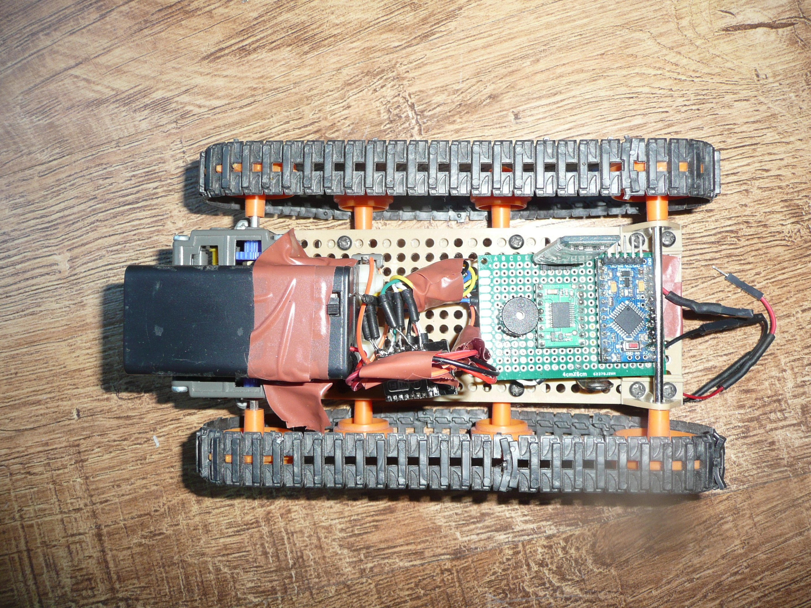

## Old school competition project (2015)

#### Control
Using Bluetooth (Android app) or by Web application

#### Components
- Tamiya 70168 with DC motors
- Tamiya 70098
- Tamiya 70100
- Arduino Pro Mini (5V)
- motor driver Pololu TB6612FNG
- ESP8266 ESP-12E
- Bluetooth HC-06
- buzzer
- PCB plate 4x6cm
- Li-Pol 350mAh 1S 3.7V (logic power)
- 2x AA Eneloop 2000mAh (motors power)

